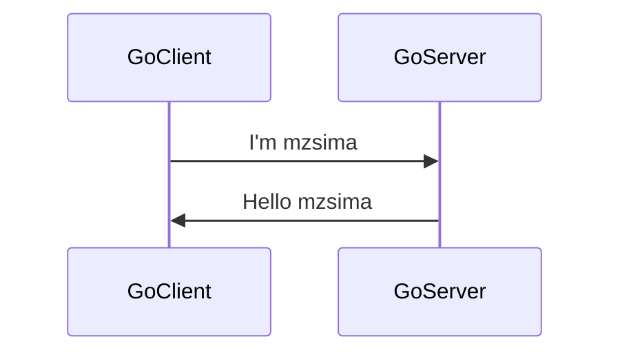
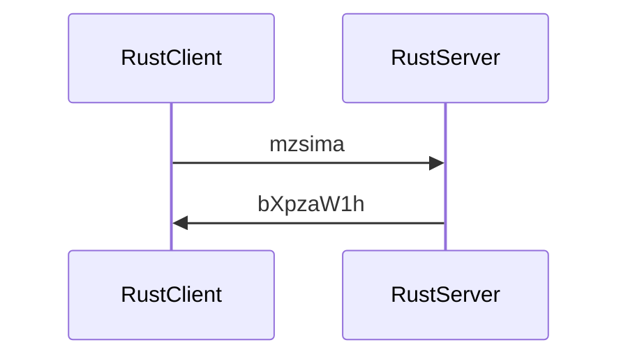

# GoとRustで繋いでみるよ。

マイクロサービスを一歩一歩。

とりあえず、GoとRustが人気ではないかと思われるので、この人気の二つでRPCしてみる。

## GoでGRPC

 - ソースは、lesson1のブランチを参照。

まずはGolang側で簡単なものを作成、GoGRPCのQUICKSTARTを見ながら、下記を作っていく。（参考：　https://grpc.io/docs/languages/go/quickstart/）



### Go周り準備

ライブラリインストール （macです。）

```sh
brew install go
brew install protobuf
```

Goのprotocol compiler インストール

```sh
go install google.golang.org/protobuf/cmd/protoc-gen-go@v1.28
go install google.golang.org/grpc/cmd/protoc-gen-go-grpc@v1.2
```

update path
```sh
export PATH="$PATH:$(go env GOPATH)/bin"
```

### Go側サービスの中身を作る

フォルダをこんな感じで用意。ルートをserviceAという名前のフォルダにして、その下にclient/server/proto用のフォルダをそれぞれ作成

```sh
serviceA
├── greeter_client
├── greeter_server
└── helloworld
```

serviceAのフォルダで、goのプロジェクトを名前serviceAで作る。

```sh
go mod init serviceA
```


#### protoファイル

下記ファイルにprotoのHelloWorldするための色々を書き込みます。

- serviceA/helloworld/helloworld.proto

書き終わったら、protoファイルからgoのソースを生成

```sh
protoc --go_out=. --go_opt=paths=source_relative \
    --go-grpc_out=. --go-grpc_opt=paths=source_relative \
    helloworld/helloworld.proto
```

実施すると、helloworldフォルダの中に、goのソースファイルが生成されるのでこれを使ってサーバー、クライアントを実装していく。


#### server

下記のファイルの中に、サーバーのプログラムを実装。

- serivceA/greeter_server/main.go

中身はココ。

https://github.com/mzsima/learn_microservice/blob/lesson1/serviceA/greeter_server/main.go

実装したら、ライブラリのアップデートして、実行する。

```sh
go mod tidy
go run greeter_server/main.go
```

下記のようなメッセージが出れば、サーバーは起動している。

```console
2022/11/26 17:35:47 server listening at [::]:50051
```

#### client

下記のファイルの中にクライアントのプログラムを実装する

- serviceA/greeter_client/main.go

中身はココ。

https://github.com/mzsima/learn_microservice/blob/lesson1/serviceA/greeter_client/main.go

#### 動作確認

実装したら、クライアントも実行する。(あらかじめサーバーは起動しておいてね。)

```sh
go run greeter_client/main.go
```

コンソールにこんな感じで、レスポンスが表示されたら通信成功。

```console
2022/11/26 17:46:09 Greeting: Hello mzsima
```

## RustでGRPC

 - ソースは、lesson2のブランチを参照。

次は、RustのサービスBをつくります。なんでもいいのですが、文字列をBase64エンコードするかんじにしてみます。GRPCの部分はtonicというライブラリを使います。(参考：https://github.com/hyperium/tonic/blob/master/examples/helloworld-tutorial.md）



### Rust周り準備

ライブラリインストール （macです。）

```sh
brew install rustup-init
rustup-init
```

### Rust側サービスの中身を作る

Cargoでプロジェクトのフォルダを作成、そのまま proto ファイルまで作る。

```sh
cargo new serviceB
cd serviceB
mkdir proto
touch proto/base64encoder.proto
```

フォルダは、こんな感じになる。

```sh
serviceB
├── Cargo.toml
├── proto
│   └── helloworld.proto
└── src
    └── main.rs
```

#### Cargo.toml

必要なライブラリ色々を記入する。

- serviceB/Cargo.toml

#### protoファイル

このファイルに、GRPCのサービス、メッセージを書き込む。

- serviceB/proto/base64encoder.proto

中身: https://github.com/mzsima/learn_microservice/blob/lesson2/serviceB/proto/base64encoder.proto

#### proto build用のソースを下記のファイルに書き込む

ここは、tonic-build用のソース。詳しくはここ https://github.com/hyperium/tonic/blob/master/tonic-build/README.md

- serviceB/build.rs

中身: https://github.com/mzsima/learn_microservice/blob/lesson2/serviceB/build.rs

#### server

下記ファイルに、サーバー側の実装を。

- src/server.rs　

中身: https://github.com/mzsima/learn_microservice/blob/lesson2/serviceB/src/server.rs

#### client

下記ファイルにクライアント側の実装を。

- src/client.rs

中身: https://github.com/mzsima/learn_microservice/blob/lesson2/serviceB/src/client.rs

#### 動作確認

サーバーの起動
```sh
cargo run --bin serviceb-server
```

クライアントの起動
```sh
cargo run --bin serviceb-client
```

クライアント側で下記のようなレスポンスをGetできれば成功

```console
RESPONSEResponse { metadata: MetadataMap { headers: {"content-type": "application/grpc", "date": "Sat, 26 Nov 2022 14:26:25 GMT", "grpc-status": "0"} }, message: Base64EncodeReply { message: "bXpzaW1h" }, extensions: Extensions }
```