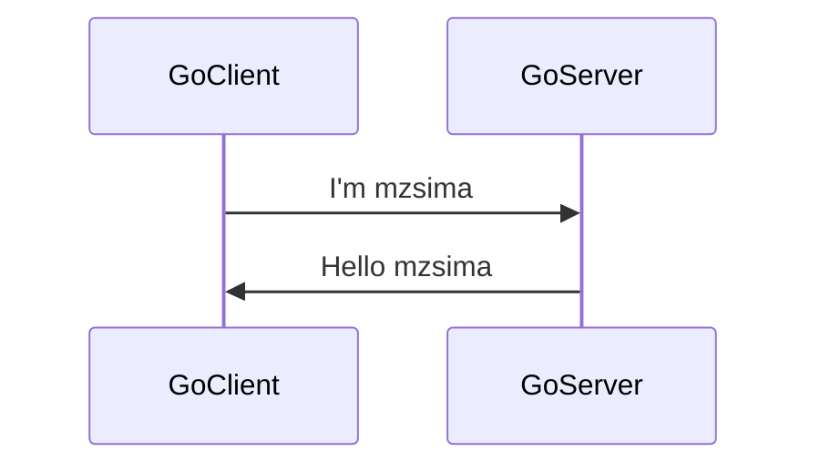

# GoとRustで繋いでみるよ。

マイクロサービスを一歩一歩。

とりあえず、GoとRustが人気ではないかと思われるので、この人気の二つでRPCしてみる。

## GoでGRPC

まずはGolang側で簡単なものを作成、GoGRPCのQUICKSTARTを見ながら、下記を作っていく。（参考：　https://grpc.io/docs/languages/go/quickstart/）



### Go周り準備

ライブラリインストール （macです。）

```sh
brew install go
brew install protobuf
```

Goのprotocol compiler インストール

```sh
go install google.golang.org/protobuf/cmd/protoc-gen-go@v1.28
go install google.golang.org/grpc/cmd/protoc-gen-go-grpc@v1.2
```

update path
```sh
export PATH="$PATH:$(go env GOPATH)/bin"
```

### Go側サービスの中身を作る

フォルダをこんな感じで用意。ルートをserviceAという名前のフォルダにして、その下にclient/server/proto用のフォルダをそれぞれ作成

```sh
serviceA
├── greeter_client
├── greeter_server
└── helloworld
```

serviceAのフォルダで、goのプロジェクトを名前serviceAで作る。

```sh
go mod init serviceA
```


#### protoファイル

下記ファイルにprotoのHelloWorldするための色々を書き込みます。

- serviceA/helloworld/helloworld.proto

書き終わったら、protoファイルからgoのソースを生成

```sh
protoc --go_out=. --go_opt=paths=source_relative \
    --go-grpc_out=. --go-grpc_opt=paths=source_relative \
    helloworld/helloworld.proto
```

実施すると、helloworldフォルダの中に、goのソースファイルが生成されるのでこれを使ってサーバー、クライアントを実装していく。


#### server

下記のファイルの中に、サーバーのプログラムを実装。

- serivceA/greeter_server/main.go

実装したら、ライブラリのアップデートして、実行する。

```sh
go mod tidy
go run greeter_server/main.go
```

下記のようなメッセージが出れば、サーバーは起動している。

```console
2022/11/26 17:35:47 server listening at [::]:50051
```

#### client

下記のファイルの中にクライアントのプログラムを実装する

- serviceA/greeter_client/main.go

実装したら、クライアントも実行する。(あらかじめサーバーは起動しておいてね。)

```sh
go run greeter_client/main.go
```

コンソールにこんな感じで、レスポンスが表示されたら通信成功。

```console
2022/11/26 17:46:09 Greeting: Hello mzsima
```